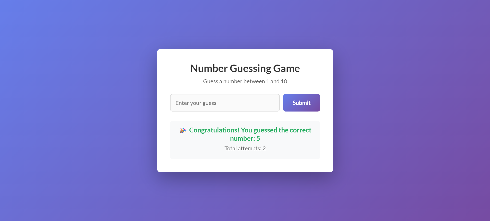

# 🎯 Number Guessing Game

A simple and fun JavaScript number guessing game.

The player guesses a number between **1 and 10**.  
The game gives feedback if the guess is too high, too low, or correct, and shows the total attempts.

---

## 📸 Preview

---

## 🚀 Live Demo
👉 https://github.com/WarunaSLFI/JS-Number-Guessing-Game

---

## 🛠️ Built With
- HTML
- CSS
- JavaScript

---

## 📚 What I Learned
- Generating random numbers
- Handling user input
- DOM manipulation
- Event listeners
